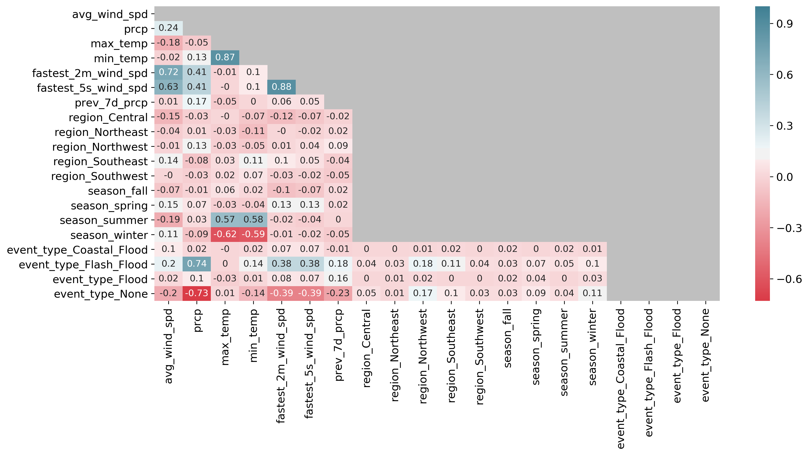

# Classifying flood events in Louisiana

Springboard Capstone 1 Final Report

By Jenny Rhee

---

## Table of Contents

1. [Introduction](#1-introduction)  
   2.1. [Problem Statement](#11-problem-statement)  
   2.2. [Client](#12-client-profile)  
2. [Data](#2-data)  
3. [Data Cleaning Summary](#3-data-cleaning-summary)  
    3.1. [Storm Events Data](#31-storm-events-data)  
    3.2. [Meteorological Data](#32-meteorological-data)  
    3.3. [Combined Storm Events and Meteorological DataFrame](#33-combined-storm-events-and-meteorological-dataframe)  
4. [Exploratory Analysis Summary](#4-exploratory-analysis-summary)  
    4.1. [Other One-way ANOVA and Tukey's Tests](#41-other-one-way-anova-and-tukeys-tests)  
5. [Flood Classification](#5-flood-classification)  
    5.1. [Data Preparation](#51-data-preparation)  
    5.2. [Model Selection](#52-model-selection)  
    5.3. [Model Fitting and Results](#53-model-fitting-and-results)  
6. [Recommendation](#6-recommendation)  
7. [Future Direction](#7-future-direction)  

## 1. Introduction

### 1.1. Problem Statement

Floods can be potentially devastating storm events that can cause injuries, deaths, and have a significant economic toll. In August 2016, Southeast Louisiana experienced prolonged rainfall (up to 2-3 inches an hour for nearly 48 hours) that resulted in catastrophic flooding and thousands of homes and businesses being submerged [(Source)](https://www.weather.gov/lix/August2016flood). It impacted areas that were not high flood risk and did not warrant mandatory flood insurance [(Source)](https://www.vox.com/2016/8/18/12522036/louisiana-flood-climate-change-emergency-management). The most flooded areas reached nearly 2 feet with some areas peaking at 31.39 inches. To put these amounts into perspective, this event dropped three times as much rain as Hurricane Katrina [(Source)](https://www.washingtonpost.com/news/capital-weather-gang/wp/2016/08/19/no-name-storm-dumped-three-times-as-much-rain-in-louisiana-as-hurricane-katrina/). The damages were approximately $10-15 billion, ranking this storm as the seventh most expensive of natural disasters in the US since 1978 [(Source)](https://www.theadvocate.com/louisiana_flood_2016/article_378487b6-768e-11e6-832f-df9408322f2c.html).

Even with floods that are not as catastrophic as the 2016 flood, minor flood events can cause substantial damage. It is important to prepare for these events. Preparation efforts include understanding the risk of flood in your area, learning evacuation routes, preparing an emergency kit, etc. However, this can only do so much--being able to anticipate potential flood events would be incredibly beneficial, especially since the prevalence is expected to increase with climate change. The goal of this project is to build a model that is capable of taking in forecast data and return the likelihood of a flood event occurring.

### 1.2. Client Profile

The National Oceanic and Atmospheric Administration’s (NOAA) agency, the National Weather Service (NWS), has a mission to provide weather, water, and climate data, forecasts, and warnings for the protection of life and property and enhancement of the national economy. Their ultimate vision is to create a weather-ready nation: a society that is prepared for and responds to weather, water, and climate-dependent events. This model will help stakeholders save lives and potentially minimize property damage, striving to achieve their vision.

## 2. Data

NWS provided [storm data](https://catalog.data.gov/dataset/ncdc-storm-events-database) containing statistics on personal injuries and damage estimates from 1950 to present. There were 34 different storm events including various types of floods, hurricanes, thunderstorms, hail, etc. There were 51 columns including damage, injuries, deaths, etc. I used [Python scripts](https://github.com/jennyrhee/storm-events/tree/master/src/preparation) to download all 213 csv files, create a database, and ingest the data into the database. Additional supporting data included historical meteorological data to analyze any potential correlations. NOAA's National Centers for Environmental Information had [Daily Summaries](https://www.ncdc.noaa.gov/cdo-web/datatools/findstation/) data at numerous stations across the United States (Figure 1). This data included air temperature, precipitation, and wind speed.

**Figure 1**. Locations of weather stations in Louisiana.

## 3. Data Cleaning Summary

### 3.1 Storm Events Data

There were several entries for parish that weren't exact parish names, mainly including a region within the parish (e.g., East Cameron vs. Cameron). These were cleaned up to be one of the distinct 64 parishes in the state. The property damage column consisted of strings with nulls, 0, or values appended by K (thousand), M (million), and B (billion). They were converted into the correct numerical values. There were 16,946 rows in the final DataFrame.

### 3.2 Meteorological Data

There were 11 variables chosen that were thought to be variables of interest: average daily wind speed (`avg_wind_spd`), precipitation (`precip`), maximum temperature (`max_temp`), minimum temperature (`min_temp`), fastest 2-minute wind speed (`fastest_2m_wind_spd`), and fastest 5-second wind speed (`fastest_5s_wind_spd`). The initial dataset had 214,708 rows.

This dataset did not include parishes for each station, so an API was used to query for each parish based on the coordinates of each station. This DataFrame was merged with the original DataFrame, and the station and elevation columns were dropped. The station data was aggregated to represent the parish in its entirety by taking the mean of all data points for stations within each station for each date. This resulted in 162,229 rows. This DataFrame was merged with the storm events DataFrame.

### 3.3 Combined Storm Events and Meteorological DataFrame

The average of hourly temperature values variable was dropped because there was a lot of missing data (~74%). For rows with null storm events data, a new event type called "None" was created indicating that no storm event happened on these days. There were 2,202 flood event types (Coastal Flood, Flash Flood, and Flood), but only 812 rows with complete meteorological data.

5,000 samples were sampled for days representing no severe storm event occurring in parishes and years that a flood event occurred. A new feature representing the previous 7-day total precipitation was created. Rows were dropped if there were less than 4 previous days of data. A region feature was created with the possible values being Northwest, Northeast, Central, Southwest, and Southeast. Finally, a seasonal feature was created (winter, spring, summer, fall). The final DataFrame had 5,812 rows.

## 4. Exploratory Analysis Summary

**Figure 2**. Counts of each flood event type.

There were 668 flash floods, 132 floods, and 11 coastal floods in the dataset (Figure 2). NWS provided [documentation](https://www.ncdc.noaa.gov/stormevents/pd01016005curr.pdf) defining the storm events recorded in the database. A flash flood was defined as a life-threatening, rapid rise of water into a normally dry area beginning within minutes to multiple hours of the causative event (e.g., intense rainfall, dam failure, ice jam). A flood was any high flow, overflow, or inundation by water which causes damage. A coastal flood was flooding of coastal areas due to vertical rise above normal water level caused by strong, persistent onshore wind, high astronomical tide, and/or low atmospheric pressure, resulting in damage, erosion, flooding, fatalities, or injuries.

For the following, one-way ANOVA tests were used to compare differences between event means for each meteorological feature, and Tukey's tests were used to identify to what extent.

**Figure 3**. Distribution of precipitation by event.

**One-way ANOVA Test:**  
F-value = 2565.98  
p-value < 0.001

| group 1 | group 2 | meandiff | lower | upper |
| --- | --- | --- | --- | --- |
| Coastal Flood | Flash Flood | 2.03 | 1.39 | 2.66 |
| Coastal Flood | None | -0.88 | -1.51 | -0.25 |
| Flash Flood | Flood | -1.72 | -1.92 | -1.52 |
| Flash Flood | None | -2.91 | -3.00 | -2.83 |
| Flood | None | -1.19 | -1.37 | -1.01 |  

**Table 1**. Tukey's test results for precipitation (significant only).

Precipitation will likely be the most important feature for the model (Figure 3). As expected, "none" events generally had the least amount of precipitation (Table 1):

- The average precipitation for days representing no flood event compared to coastal floods was -0.88 inches.
- The average precipitation for days representing no flood event compared to flash floods was -2.91 inches.
- The average precipitation for days representing no flood event compared to floods was -1.19 inches.

...while flash floods had the most amount of precipitation:

- The average precipitation for flash floods compared to coastal floods was 2.03 inches.
- The average precipitation for flash floods compared to floods was 1.72 inches.

**Figure 4**. Distribution of previous 7-day precipitation by event.

**One-way ANOVA Test:**  
F-value = 125.78  
p-value < 0.001  

| group 1 | group 2 | meandiff | lower | upper |
| --- | --- | --- | --- | --- |
| Coastal Flood | Flood | 6.40 | 2.61 | 10.20 |
| Flash Flood | Flood | 2.77 | 1.62 | 3.92 |
| Flash Flood | None | -2.84 | -3.34 | -2.34 |
| Flood | None | -5.61 | -6.67 | -4.54 |  

**Table 2**. Tukey's test results for previous 7-day precipitation (significant only).

Interestingly, coastal floods seem to have the least amount of previous 7-day precipitation (Figure 4; Table 2):

- The average 7-day precipitation for coastal floods compared to floods was -6.40 inches.

The small sample size (n = 11) and the fact that these events happen in typically dry lands could be a reason why previous 7-day precipitation is lower than days with no severe storm event.

Otherwise, floods generally have more precipitation in the previous 7 days than flash floods, while days representing no flood events have less than flash floods and floods.

**Figure 5**. Distribution of wind speed by event.

**One-way ANOVA Test:**  
F-value = 102.07  
p-value < 0.001  

| group 1 | group 2 | meandiff | lower | upper |
| --- | --- | --- | --- | --- |
| Coastal Flood | Flash Flood | -5.74 | -8.41 | -3.07 |
| Coastal Flood | Flood | -7.22 | -9.97 | -4.46 |
| Coastal Flood | None | -7.96 | -10.61 | -5.31 |
| Flash Flood | Flood | -1.48 | -2.32 | -0.65 |
| Flash Flood | None | -2.22 | -2.58 | -1.86 |  

**Table 3**. Tukey's test results for average wind speed (significant only).

Wind speed is another interesting feature to consider (Figure 5). Coastal flood has a higher average wind speed than the other event types (Table 3):

- The average wind speed for days representing coastal floods compared to flash floods is 5.74 mph.
- The average wind speed for days representing coastal floods compared to floods is 7.22 mph.
- The average wind speed for days representing coastal floods compared to days representing no flood events is 7.96 mph.

This is intuitive because these events are caused by coastal processes such as waves, tides, and storm surges, which are strongly influenced by wind.

**Figure 6**. Correlation matrix for all features.

Three different methods were used to find correlation coefficients depending on the variable types being compared (Figure 8). Pearson's correlation was used for continuous vs. continuous variables [-1, 1]. Point biserial correlation was used for categorical vs. continuous variables [-1, 1]. Cramer's V was used for categorical vs. categorical variables [0, 1]. The grey area indicates relationships that are with themselves (e.g., `avg_wind_spd` vs. `avg_wind_spd`, etc.), relationships that are nonsensical (e.g., region vs. season, etc.), or repeating values (e.g., `prcp` vs. `avg_wind_spd` shown only once). Any relationships that were not statistically significant were also greyed out.

### 4.1 Other One-way ANOVA and Tukey's Tests

The following tests were for other features that likely have minimal impact on the likelihood of a flood event and had either a couple or no significant results. As a reminder, the one-way ANOVA tests were used to compare differences between event means for each meteorological feature, and Tukey's tests were used to identify to what extent.

#### 4.1.1. min_temp

**One-way ANOVA Test:**  
F-value = 42.28  
p-value < 0.001  

| group 1 | group 2 | meandiff | lower | upper |
| --- | --- | --- | --- | --- |
| Flash Flood | Flood | -4.66 | -8.12 | -1.21 |
| Flash Flood | None | -6.49 | -7.98 | -4.99 |  

**Table 4**. Tukey's test results for minimum temperature (significant only).

Flash floods had lower average minimum temperature compared to floods (-4.66℉) and days representing no flood events (-6.49℉; Table 4).

#### 4.1.2. max_temp

**One-way ANOVA Test:**
F-value = 2.12
p-value = 0.096

There were no significant results among flood events for maximum temperature comparisons.

## 5. Flood Classification

This modeling task was to classify whether or not a flood event occurred, which is a binary classification (supervised learning) problem. The feature categories were meteorological, regional, and seasonal variables.

### 5.1. Data Preparation

All unnecessary columns were dropped (dates, FIPS code, parish, coordinates, injuries, deaths, property damage). For the binary classification problem, it was decided to drop coastal flood events because they were too different from other flood events, and the sample size was not large enough. The data was separated into X (features) and y (target) variables. The data was split into training and testing sets, and a stratification test was done to confirm the split successfully distributed the classes evenly.

Two additional data sets with the feature data were also created--one standardized using `sklearn.preprocessing.scale` and another scaled using `MinMaxScaler`. The first method standardizes by centering the data to the mean and does a component-wise scale to unit variance. The latter scales and translates each feature individually such that it is in the given range on the training set, e.g., between 0 and 1. The three data sets were used to train the models and compare performance.

### 5.2. Model Selection

Two classification algorithms were used: logistic regression (`LogisticRegressionCV`) and random forest (`RandomForestClassifier`). Both algorithms are beneficial because they are both generally easy to interpret. Logistic regression is the go-to method for binary classification problems. Random forests are an ensemble classification method and work well with fitting categorical features and high dimensional data. Hyperparameter tuning was implemented for both models using `GridSearchCV`.

### 5.3. Model Fitting and Results

#### 5.3.1. Metric Choice

Choosing the metric to optimize for is essentially a business decision; by default, it is arbitrarily set to 0.5. F-β score is a way of measuring accuracy in a model by taking into account both precision and recall. Precision is a metric that calculates the percentage of correct predictions for the positive class, while recall calculates the percentage of correct predictions for the positive class out of all positive predictions that could be made (Source). β can be configured to give more weight to precision or recall. Ultimately, a decision was made to optimize for β = 2, which puts twice as much emphasis on recall. The advantage of this β-value is that the model will find more actual flood events. However, the disadvantage is the model will more likely label an event as a flood event when this may not be the case. This tradeoff is more ideal than the alternative because we would rather not miss any true flood events.

#### 5.3.2. Logistic Regression

| data | ROC-AUC testing score |
| --- | --- |
| No preprocessing | 0.969673 |
| `MinMaxScaler` | 0.969586 |
| `scale` | 0.969665 |

**Table 5**. Logistic regression model evaluation results.

The scoring function used to evaluate the models was ROC-AUC. ROC is a probability curve plotted at different thresholds, where the true positive rate is plotted against the false positive rate. AUC represents degree or measure of separability (how much the model is capable of distinguishing between classes). The three data sets described earlier (unprocessed, scaled, and standardized) were used to train three different models and compare performance. The unprocessed data performed the best and was used to train the final model (Table 5).

**Figure 7**. ROC curve for the final logistic regression model.

The hyperparameters for the final model were optimized using a grid search; the best parameters were `Cs` = 59.948 and `penalty` = L2. The ROC-AUC score was 0.9676 (Figure 7).

**Figure 8**. Threshold curve for the final logistic regression model.

The final step was choosing what threshold probability should be used to optimize the F-2 score. The optimal threshold was 0.106, and the best F-2 score was 0.833 (Figure 8).

| | no flood | flood |
| --- | --- | --- |
| **no flood** | 1138 | 109 |
| **flood** | 19 | 184 |

**Table 6**. Confusion matrix for the final logistic regression model with threshold probability = 0.106.

| | precision | recall | f1-score | support |
| --- | --- | --- | --- | --- |
| 0 | 0.96 | 0.91 | 0.95 | 1247 |
| 1 | 0.63 | 0.91 | 0.74 | 203 |
| **accuracy** | | | 0.91 | 1450 |
| **macro avg** | 0.81 | 0.91 | 0.84 | 1450 |
| **weighted avg** | 0.93 | 0.91 | 0.92 | 1450 |

**Table 7**. Classification report for the final logistic regression model with threshold probability = 0.106.

The confusion matrix from the final logistic regression model can be found in Table 6, and the classification report can be found in Table 7.

#### 5.3.3. Random Forest

| data | mean accuracy testing score |
| --- | --- |
| No preprocessing | 0.9503 |
| `MinMaxScaler` | 0.9448 |
| `scale` | 0.9497 |

**Table 8**. Random forest model evaluation results.

The three data sets described earlier (unprocessed, scaled, and standardized) were used to train three different models and compare performance. The unprocessed data performed the best and was used to train the final model (Table 8).

**Figure 9**. ROC curve for the final random forest model.

The hyperparameters for the model were optimized using a grid search; the best parameters were `min_samples_leaf` = 0.001 and `min_samples_split` = 0.001. The ROC-AUC score was 0.9696 (Figure 9).

**Figure 10**. Threshold curve for the final random forest model.

The final step was choosing what threshold probability should be used to optimize the F-2 score. The optimal threshold was 0.241, and the best F-2 score was 0.839 (Figure 10).

| | no flood | flood |
| --- | --- | --- |
| **no flood** | 1186 | 61 |
| **flood** | 27 | 176 |

**Table 9**. Confusion matrix for the final random forest model with threshold probability = 0.241.

| | precision | recall | f1-score | support |
| --- | --- | --- | --- | --- |
| 0 | 0.98 | 0.95 | 0.96 | 1247 |
| 1 | 0.74 | 0.87 | 0.80 | 203 |
| **accuracy** | | | 0.94 | 1450 |
| **macro avg** | 0.86 | 0.91 | 0.88 | 1450 |
| **weighted avg** | 0.94 | 0.94 | 0.94 | 1450 |

**Table 10**. Classification report for the final random forest model with threshold probability = 0.241.

The confusion matrix from the final random forest model can be found in Table 9, and the classification report can be found in Table 10.

**Figure 11**. Feature importances determined by the random forest model.

The feature importances can be found in Figure 11. As expected, precipitation was by far the most important feature (0.610 vs. 0.084 for fastest 5 sec wind speed in second place). The least important features for the model were seasonal and regional.

## 6. Recommendation

The random forest performed the best with F-2 score = 0.839 vs. logistic regression’s F-2 score = 0.836. As expected, precipitation is the most important feature in classifying a flood event, followed by the fastest 2-minute and 5-second wind speeds. I would recommend implementing a random forest classification model and run the model multiple times daily with updated forecast data. The forecast data will likely become more accurate as the day continues. The model can be monitored or actions can be taken based on the predictions throughout the day.

## 7. Future Direction

Next steps would include putting the model into production and automating the model to run at an ideal frequency (i.e., as often as forecast data updates). Further data exploration should be done in order to find other data sources or potentially feature engineering to strengthen the model. Predictive weather models are exceptionally complex, and there is likely much more that can be done to develop a stronger model with a higher F-2 score. Additionally, a web application should be developed for easier access to the model.
