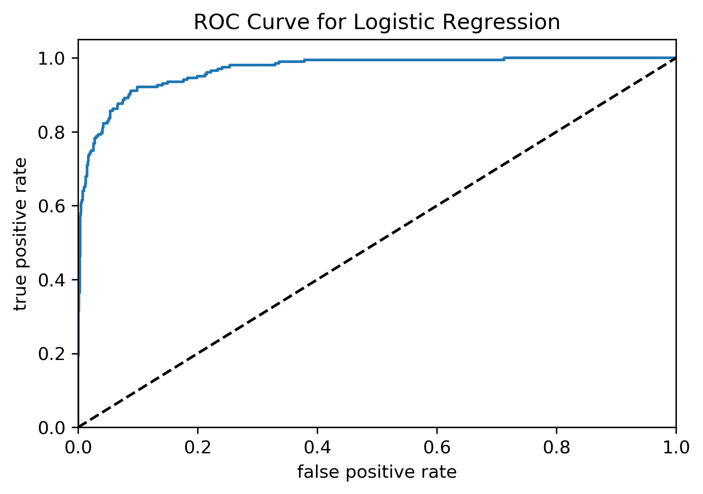

# Predicting flood events in Louisiana

Springboard Capstone 1 Final Report

By Jenny Rhee

---

## Table of Contents

1. [Problem Statement](#1-problem-statement)  
2. [Data](#2-data)  
3. [Data Cleaning Summary](#3-data-cleaning-summary)  
    3.1. [Storm Events Data](#31-storm-events-data)  
    3.2. [Meteorological Data](#32-meteorological-data)  
    3.3. [Combined Storm Events and Meteorological DataFrame](#33-combined-storm-events-and-meteorological-dataframe)  
4. [Exploratory Analysis Summary](#4-exploratory-analysis-summary)  
5. [Flood Classification](#5-flood-classification)  
    5.1. [Data Preparation](#51-data-preparation)  
    5.2. [Model Selection](#52-model-selection)  
    5.3. [Model Fitting and Results](#53-model-fitting-and-results)  
6. [Conclusion](#6-conclusion)  
   6.1 [Future Direction](#61-future-direction)  

## 1. Problem Statement

The goal of this capstone project is to classify flood events in Louisiana. People will likely have experience with flooding, but the prevalence is expected to increase with climate change. It is important to begin understanding the rising trends. Building this model can classify existing weather data with missing flood event labels as a precursor to building a predictive model. The importance of this is the capability to efficiently label a large data set. Flood event data collection began in 1996, but there is significantly more meteorological data available that can be labeled using this model in order to expand the data set to train a predictive model in the future.

## 2. Data

The National Weather Service provides [storm data](https://catalog.data.gov/dataset/ncdc-storm-events-database) containing statistics on personal injuries and damage estimates from 1950 to present. There are 34 different storm events including various types of floods, hurricanes, thunderstorms, hail, etc. There are 51 columns including damage, injuries, deaths, etc. I used [Python scripts](https://github.com/jennyrhee/storm-events/tree/master/src/preparation) to download all 213 csv files, create a database, and ingest the data into the database. Additional supporting data includes historical meteorological data to analyze any potential correlations. NOAA's National Centers for Environmental Information has [Daily Summaries](https://www.ncdc.noaa.gov/cdo-web/datatools/findstation/) data at numerous stations across the United States (Figure 1). This data included air temperature, precipitation, and wind speed.

**Figure 1**. Locations of weather stations in Louisiana.

## 3. Data Cleaning Summary

### 3.1 Storm Events Data

There were several entries for parish that weren't exact parish names, mainly including a region within the parish (e.g., East Cameron vs. Cameron). The FIPS DataFrame was used to check the FIPS code for each of the entries and compared with the actual parish FIPS codes. One parish, Sabine and Natchitoches, had coordinates that could be checked using the [coordinates2politics API](http://www.datasciencetoolkit.org/coordinates2politics/) was used to find the parish based on coordinates; Sabine was returned. Some of the entries had invalid FIPS codes (from comparing with the Louisiana parish Wikipedia page). The names were changed to remove the region and contain only the parish. There were 52 remaining rows with null parishes. The coordinates2politics API was again used to try and find the parish. 14 rows returned no parish data and were dropped. Finally, the parishes were mapped to the correct FIPS code to create a FIPS column. There were a few rows with null FIPS, but they were counties outside of Louisiana and were dropped.

The property damage column consisted of strings with nulls, 0, or values appended by K (thousand), M (million), and B (billion). They were converted into the correct numerical values.

There were 16,946 rows in the final DataFrame.

### 3.2 Meteorological Data

There were 11 variables chosen that were thought to be variables of interest: average daily wind speed (`avg_wind_spd`), precipitation (`precip`), maximum temperature (`max_temp`), minimum temperature (`min_temp`), fastest 2-minute wind speed (`fastest_2m_wind_spd`), and fastest 5-second wind speed (`fastest_5s_wind_spd`). The initial dataset had 214,708 rows.

A new DataFrame was created with name, latitude, and longitude from the original DataFrame, and duplicates were dropped. Using multi-processing (`pandarallel` library), the coordinates2politics API was used to query for each parish based on the coordinates of each station. This DataFrame was merged with the original DataFrame, and the station and elevation columns were dropped.

The station data was aggregated to represent the parish in its entirety by taking the mean of all data points for stations within each station for each date. This resulted in 162,229 rows. This DataFrame was merged with the storm events DataFrame.

### 3.3 Combined Storm Events and Meteorological DataFrame

The average of hourly temperature values variable was dropped because there was a lot of missing data (~74%). For rows with null storm events data, a new event type called "None" was created indicating that no event happened on these days. There were 2,202 flood event types (Coastal Flood, Flash Flood, and Flood), but only 812 rows with complete meteorological data.

5,000 samples were sampled for none events that occurred in parishes and years that a flood event occurred. A new feature representing the previous 7-day total precipitation was created. Rows were dropped if there were less than 4 previous days of data. Another feature representing region was created with possible values being Northwest, Northeast, Central, Southwest, and Southeast. Finally, a season feature was created (winter, spring, summer, fall). The final DataFrame had 5,812 rows.

## 4. Exploratory Analysis Summary

**Figure 2**. Counts of each flood event type.

There were 668 flash floods, 132 floods, and 11 coastal floods in the dataset (Figure 2).

For the following, one-way ANOVA tests were used to compare differences between event means for each meteorological feature, and Tukey's tests were used to identify to what extent.

**Figure 3**. Distribution of precipitation by event.

**One-way ANOVA Test:**  
F-value = 2565.98  
p-value < 0.001

| group 1 | group 2 | meandiff | lower | upper |
| --- | --- | --- | --- | --- |
| Coastal Flood | Flash Flood | 2.03 | 1.39 | 2.66 |
| Coastal Flood | None | -0.88 | -1.51 | -0.25 |
| Flash Flood | Flood | -1.72 | -1.92 | -1.52 |
| Flash Flood | None | -2.91 | -3.00 | -2.83 |
| Flood | None | -1.19 | -1.37 | -1.01 |  

**Table 1**. Tukey's test results for precipitation (significant only).

Precipitation will likely be the most important feature (Figure 3). As expected, "none" events generally had the least amount of precipitation (Table 1):

- $\mu_{none} - \mu_{coastal} = -0.88$
- $\mu_{none} - \mu_{flash} = -2.91$
- $\mu_{none} - \mu_{flood} = -1.19$
  
...while flash floods had the most amount of precipitation:

- $\mu_{flash} - \mu_{coastal} = 2.03$
- $\mu_{flash} - \mu_{flood} = 1.72$
- $\mu_{flash} - \mu_{none} = 2.91$

**Figure 4**. Distribution of previous 7-day precipitation by event.

**One-way ANOVA Test:**  
F-value = 125.78  
p-value < 0.001  

| group 1 | group 2 | meandiff | lower | upper |
| --- | --- | --- | --- | --- |
| Coastal Flood | Flood | 6.40 | 2.61 | 10.20 |
| Flash Flood | Flood | 2.77 | 1.62 | 3.92 |
| Flash Flood | None | -2.77 | -3.34 | -2.34 |
| Flood | None | -1.19 | -1.37 | -1.01 |  

**Table 2**. Tukey's test results for previous 7 day precipitation (significant only).

Interestingly, coastal floods seem to have the least amount of previous 7-day precipitation (Figure 4; Table 2):

- $\mu_{coastal} - \mu_{flood} = -6.40$

Coastal flooding is when a coastal process (e.g., waves, tides, storm surge) produces a flood on normally dry land areas ([Source](https://www.researchgate.net/publication/259740986_Coastal_Hazards_and_Climate_Change_A_Guidance_Manual_for_Local_Government_in_New_Zealand)). Additionally, there are only 11 coastal flood events in the dataset. The small sample size and the fact that these events happen in typically dry lands could be a reason why previous 7-day precipitation is lower than no events.

**Figure 5**. Distribution of wind speed by event.

**One-way ANOVA Test:**  
F-value = 102.07  
p-value < 0.001  

| group 1 | group 2 | meandiff | lower | upper |
| --- | --- | --- | --- | --- |
| Coastal Flood | Flash Flood | -5.74 | -8.41 | -3.07 |
| Coastal Flood | Flood | -7.22 | -9.97 | -4.46 |
| Coastal Flood | None | -7.96 | -10.61 | -5.31 |
| Flash Flood | Flood | -1.48 | -2.32 | -0.65 |
| Flash Flood | None | -2.22 | -2.58 | -1.86 |  

**Table 3**. Tukey's test results for average wind speed (significant only).

Wind speed is another interesting feature to consider (Figure 5). Coastal flood has a higher average wind speed than the other event types (Table 3):

- $\mu_{coastal} - \mu_{flash} = 5.74$
- $\mu_{coastal} - \mu_{flood} = 7.22$
- $\mu_{coastal} - \mu_{none} = 7.96$

This is intuitive because these events are caused by coastal processes such as waves, tides, and storm surges, which are strongly influenced by wind.

**Figure 6**. Correlation matrix for all features.

There different methods were used to find correlation coefficients depending on the variable types being compared (Figure 8). Pearson's correlation was used for continuous vs. continuous variables [-1, 1]. Point biserial correlation was used for categorical vs. continuous variables [-1, 1]. Cramer's V was used for categorical vs. categorical variables [0, 1]. The grey area indicates relationships that are with themselves (e.g., `avg_wind_spd` vs. `avg_wind_spd`, etc.), relationships that are nonsensical (e.g., region vs. season, etc.), or repeating values (e.g., `prcp` vs. `avg_wind_spd` shown only once).

### 4.1 Other One-way ANOVA and Tukey's Tests

#### 4.1.1. min_temp

**One-way ANOVA Test:**  
F-value = 42.28  
p-value < 0.001  

| group 1 | group 2 | meandiff | lower | upper |
| --- | --- | --- | --- | --- |
| Flash Flood | Flood | -4.66 | -8.12 | -1.21 |
| Flash Flood | None | -6.49 | -7.98 | -4.99 |  

**Table 4**. Tukey's test results for minimum temperature (significant only).

#### 4.1.2. max_temp

**One-way ANOVA Test:**
F-value = 2.12
p-value = 0.096

## 5. Flood Classification

This modeling task was to predict whether or not a flood event occurred, which is a binary classification (supervised learning) problem. The feature categories were meteorological, regional, and seasonal variables.

### 5.1. Data Preparation

All unnecessary columns were dropped (dates, FIPS code, parish, coordinates, injuries, deaths, property damage). For the binary classification problem, it was decided to drop coastal flood events because they were too different from other flood events, and the sample size was not large enough. The data was separated into X (features) and y (target) variables. The data was split into training and testing sets, and a stratification test was done to confirm the split successfully distributed the classes evenly.

Two additional data sets with the feature data were also created--one standardized using `sklearn.preprocessing.scale` and another scaled using `MinMaxScaler`. The first method standardizes by centering the data to the mean and does a component-wise scale to unit variance. The latter scales and translates each feature individually such that it is in the given range on the training set, e.g., between 0 and 1. The three data sets were used to train the models and compare performance.

### 5.2. Model Selection

Two classification algorithms were used: logistic regression (`LogisticRegressionCV`) and random forest (`RandomForestClassifier`). Both algorithms are beneficial because they are both generally easy to interpret. Logistic regression is the go-to method for binary classification problems. Random forests are an ensemble classification method and work well with fitting categorical features and high dimensional data. Hyperparameter tuning was implemented for both models using `GridSearchCV`.

### 5.3. Model Fitting and Results

#### 5.3.1. Logistic Regression

| data | ROC-AUC testing score |
| --- | --- |
| No preprocessing | 0.969673 |
| `MinMaxScaler` | 0.969586 |
| `scale` | 0.969665 |

**Table 5**. Logistic regression model evaluation results.

The scoring function used to evaluate the models was ROC-AUC. ROC is a probability curve plotted at different thresholds, where the true positive rate is plotted against the false positive rate. AUC represents degree or measure of separability (how much the model is capable of distinguishing between classes). The three data sets described earlier (unprocessed, scaled, and standardized) were used to train three different models and compare performance. The unprocessed data performed the best and was used to train the final model (Table 5).

 The hyperparameter grid used for model tuning was `penalty` = L1 or L2, and ten `Cs` spaced evenly from 0 to 4. L1 regularization (Lasso) shrinks the less important feature's coefficient to 0, thus removing some features altogether. L2 regularization (Ridge) shrinks all the coefficients by the same proportions and eliminates none. The best parameters were `Cs` = 59.948 and `penalty` = L2. The final model was trained using these parameters.

| | no flood | flood |
| --- | --- | --- |
| **no flood** | 1226 | 21 |
| **flood** | 57 | 146 |

**Table 6**. Confusion matrix for the final logistic regression model.

| | precision | recall | f1-score | support |
| --- | --- | --- | --- | --- |
| 0 | 0.96 | 0.98 | 0.97 | 1247 |
| 1 | 0.87 | 0.72 | 0.79 | 203 |
| **accuracy** | | | 0.95 | 1450 |
| **macro avg** | 0.91 | 0.85 | 0.88 | 1450 |
| **weighted avg** | 0.94 | 0.95 | 0.94 | 1450 |

**Table 7**. Classification report for the final logistic regression model.

The confusion matrix from the final logistic regression model can be found in Table 6, and the classification report can be found in Table 7.

**Figure 7**. ROC curve for the final logistic regression model.

The final step was optimizing threshold to obtain a higher f-2 score (chosen to optimize recall, which minimizes false negatives; aiming to correctly classify true flood events). The optimal threshold was 0.106, and the best f-2 score was 0.833 (Figure 7). The ROC-AUC score was 0.9676.

#### 5.3.2. Random Forest

| data | mean accuracy testing score |
| --- | --- |
| No preprocessing | 0.9503 |
| `MinMaxScaler` | 0.9448 |
| `scale` | 0.9497 |

**Table 8**. Random forest model evaluation results.

The three data sets described earlier (unprocessed, scaled, and standardized) were used to train three different models and compare performance. The unprocessed data performed the best and was used to train the final model (Table 8).

The hyperparameter grid used for model tuning was  `min_samples_leaf` = 0.001, 0.01, 0.1, or 1 and `min_samples_split` = 0.001, 0.01, 0.1, or 1. `min_samples_leaf` is the minimum number of samples required to be at a leaf node. `min_samples_split` is the minimum number of samples required to split an internal node. The float values reflect the percentage of samples used for each parameter. The best parameters were `min_samples_leaf` = 0.001 and `min_samples_split` = 0.001, and the final model was trained using these parameters.

| | no flood | flood |
| --- | --- | --- |
| **no flood** | 1223 | 24 |
| **flood** | 46 | 154 |

**Table 9**. Confusion matrix for the final random forest model.

| | precision | recall | f1-score | support |
| --- | --- | --- | --- | --- |
| 0 | 0.96 | 0.98 | 0.97 | 1247 |
| 1 | 0.87 | 0.76 | 0.81 | 203 |
| **accuracy** | | | 0.95 | 1450 |
| **macro avg** | 0.91 | 0.87 | 0.89 | 1450 |
| **weighted avg** | 0.95 | 0.95 | 0.95 | 1450 |

**Table 10**. Classification report for the final random forest model.

The confusion matrix from the final random forest model can be found in Table 9, and the classification report can be found in Table 10.

**Figure 8**. ROC curve for the final random forest model.

The final step was optimizing threshold to obtain a higher f-2 score. The optimal threshold was 0.241, and the best f-2 score was 0.839. The ROC-AUC score was 0.9696.

| feature | importance |
| --- | --- |
| precipitation | 0.610 |
| fastest 5 sec wind speed | 0.084 |
| fastest 2 min wind speed | 0.075 |
| previous 7 day precipitation | 0.067 |
| min temperature | 0.042 |
| max temperature | 0.041 |
| average wind speed | 0.033 |
| Northwest region | 0.021 |
| Southeast region | 0.005 |
| summer season | 0.005 |
| spring season | 0.004 |
| winter season | 0.004 |
| Southwest region | 0.004 |
| fall season | 0.003 |
| Northeast region | 0.001 |
| Central region | 0.001 |

**Table 11**. Feature importances determined by the random forest model.

The feature importances can be found in Table 11. As expected, precipitation was by far the most importance feature (0.610 vs. 0.084 for fastest 5 sec wind speed in second place). The least important features for the model were seasonal and regional.

## 6. Recommendation

In terms of our business decision of optimizing recall, the random forest performed the best with f-2 score = 0.839 vs. logistic regression f-2 score = 0.836. Being that we want to minimize overlooking flood events, I would recommend implementing a random forest classification model.

### 6.1. Future Direction

The natural next step is to implement a multinomial model that can predict the type of flood event detected (e.g., Coastal Flood vs. Flash Flood vs. Flood, etc.). The binary model is important to begin labeling our much larger meteorological data set, but the ultimate goal is to predict future flood events. This is an exceptionally difficult problem that many people have tried to solve. Future efforts would specifically include adding labels to the data set where they are missing and exploring additional features to strengthen the possibility of building a predictive model.
