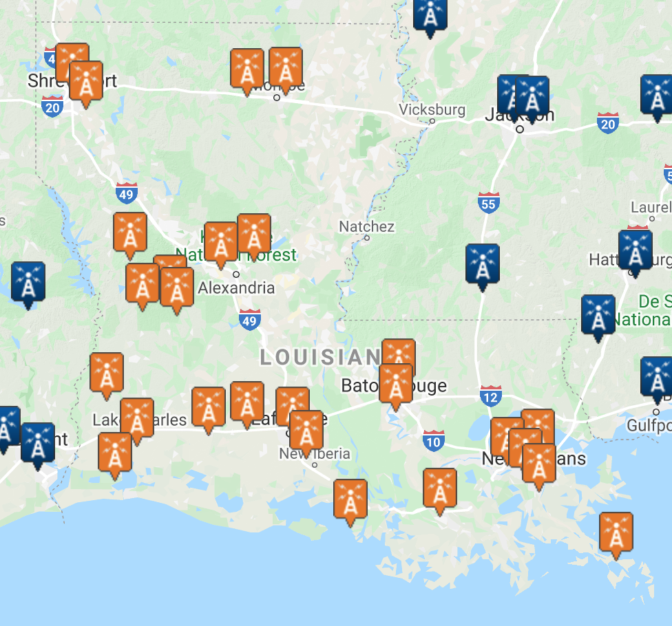

# Predicting flood events in Louisiana

Springboard Capstone 1 Milestone Report

By Jenny Rhee

---

## Problem Statement

The goal of this capstone project is to predict flood events in Louisiana. Building this model can potentially assist cities and the general population in preparation for flooding. People will likely have experience with flooding, but the prevalence is expected to increase with climate change. It is important to begin understanding the rising trends.

## Data

The National Weather Service provides [storm data](https://catalog.data.gov/dataset/ncdc-storm-events-database) containing statistics on personal injuries and damage estimates from 1950 to present. There are 34 different storm events including various types of floods, hurricanes, thunderstorms, hail, etc. There are 51 columns including damage, injuries, deaths, etc. I used [Python scripts](https://github.com/jennyrhee/storm-events/tree/master/src/preparation) to download all 213 csv files, create a database, and injest the data into the database. Additional supporting data includes historical meteorological data to analyze any potential correlations. NOAA's National Centers for Environmental Information has [Daily Summaries](https://www.ncdc.noaa.gov/cdo-web/datatools/findstation/) data at numerous stations across the United States (Figure 1). This data included air temperature, precipitation, and wind speed.

**Figure 1**. Locations of weather stations in Louisiana.

## Data Cleaning Summary

### Storm Events Data

There were several entries for parish that weren't exact parish names, mainly including a region within the parish (e.g., East Cameron vs. Cameron). The FIPS DataFrame was used to check the FIPS code for each of the entries and compared with the actual parish FIPS codes. One parish, Sabine and Natchitoches, had coordinates that could be checked using the [coordinates2politics API](http://www.datasciencetoolkit.org/coordinates2politics/) was used to find the parish based on coordinates; Sabine was returned. Some of the entries had invalid FIPS codes (from comparing with the Louisiana parish Wikipedia page). The names were changed to remove the region and contain only the parish. There were 52 remaining rows with null parishes. The coordinates2politics API was again used to try and find the parish. 14 rows returned no parish data and were dropped. Finally, the parishes were mapped to the correct FIPS code to create a FIPS column. There were a few rows with null FIPS, but they were counties outside of Louisiana and were dropped.

The property damage column consisted of strings with nulls, 0, or values appended by K (thousand), M (million), and B (billion). They were converted into the correct numerical values.

There were 16,946 rows in the final DataFrame.

### Meteorological Data

There were 11 variables chosen that were thought to be variables of interest: average daily wind speed (`avg_wind_spd`), precipitation (`precip`), maximum temperature (`max_temp`), minimum temperature (`min_temp`), fastest 2-minute wind speed (`fastest_2m_wind_spd`), and fastest 5-second wind speed (`fastest_5s_wind_spd`). The initial dataset had 214,708 rows.

A new DataFrame was created with name, latitude, and longitude from the original DataFrame, and duplicates were dropped. Using multi-processing (`pandarallel` library), the coordinates2politics API was used to query for each parish based on the coordinates of each station. This DataFrame was merged with the original DataFrame, and the station and elevation columns were dropped.

The station data was aggregated to represent the parish in its entirety by taking the mean of all data points for stations within each station for each date. This resulted in 162,229 rows. This DataFrame was merged with the storm events DataFrame.

### Combined Storm Events and Meteorological DataFrame

The average of hourly temperature values variable was dropped because there was a lot of missing data (~74%). For rows with null storm events data, a new event type called "None" was created indicating that no event happened on these days. There were 2,202 flood event types (Coastal Flood, Flash Flood, and Flood), but only 812 rows with complete meteorological data.

5,000 samples were sampled for none events that occurred in parishes and years that a flood event occurred. A new feature representing the previous 7-day total precipitation was created. Rows were dropped if there were less than 4 previous days of data. Another feature representing region was created with possible values being Northwest, Northeast, Central, Southwest, and Southeast. Finally, a season feature was created (winter, spring, summer, fall). The final DataFrame had 5,812 rows.

## Exploratory Analysis Summary

**Figure 2**. Counts of each flood event type.

There were 668 flash floods, 132 floods, and 11 coastal floods in the dataset (Figure 2).

For the following, one-way ANOVA tests were used to compare differences between event means for each meteorological feature, and Tukey's tests were used to identify to what extent.

**Figure 3**. Distribution of precipitation by event.

**One-way ANOVA Test:**
F-value = 2565.98
p-value < 0.001

| group 1 | group 2 | meandiff | lower | upper |
| --- | --- | --- | --- | --- |
| Coastal Flood | Flash Flood | 2.03 | 1.39 | 2.66 |
| Coastal Flood | None | -0.88 | -1.51 | -0.25 |
| Flash Flood | Flood | -1.72 | -1.92 | -1.52 |
| Flash Flood | None | -2.91 | -3.00 | -2.83 |
| Flood | None | -1.19 | -1.37 | -1.01 | 

**Table 1**. Tukey's test results for precipitation (significant only).

Precipitation will likely be the most important feature (Figure 3). As expected, "none" events generally had the least amount of precipitation (Table 1):

- $\mu_{none} - \mu_{coastal} = -0.88$
- $\mu_{none} - \mu_{flash} = -2.91$
- $\mu_{none} - \mu_{flood} = -1.19$
  
...while flash floods had the most amount of precipitation:

- $\mu_{flash} - \mu_{coastal} = 2.03$
- $\mu_{flash} - \mu_{flood} = 1.72$
- $\mu_{flash} - \mu_{none} = 2.91$

**Figure 4**. Distribution of previous 7-day precipitation by event.

**One-way ANOVA Test:**
F-value = 125.78
p-value < 0.001

| group 1 | group 2 | meandiff | lower | upper |
| --- | --- | --- | --- | --- |
| Coastal Flood | Flood | 6.40 | 2.61 | 10.20 |
| Flash Flood | Flood | 2.77 | 1.62 | 3.92 |
| Flash Flood | None | -2.77 | -3.34 | -2.34 |
| Flood | None | -1.19 | -1.37 | -1.01 | 

**Table 2**. Tukey's test results for previous 7 day precipitation (significant only).

Interestingly, coastal floods seem to have the least amount of previous 7-day precipitation (Figure 4; Table 2):

- $\mu_{coastal} - \mu_{flood} = -6.40$

Coastal flooding is when a coastal process (e.g., waves, tides, storm surge) produces a flood on normally dry land areas ([Source](https://www.researchgate.net/publication/259740986_Coastal_Hazards_and_Climate_Change_A_Guidance_Manual_for_Local_Government_in_New_Zealand)). Additionally, there are only 11 coastal flood events in the dataset. The small sample size and the fact that these events happen in typically dry lands could be a reason why previous 7-day precipitation is lower than no events.

**Figure 5**. Distribution of wind speed by event.

**One-way ANOVA Test:**
F-value = 102.07
p-value < 0.001

| group 1 | group 2 | meandiff | lower | upper |
| --- | --- | --- | --- | --- |
| Coastal Flood | Flash Flood | -5.74 | -8.41 | -3.07 |
| Coastal Flood | Flood | -7.22 | -9.97 | -4.46 |
| Coastal Flood | None | -7.96 | -10.61 | -5.31 |
| Flash Flood | Flood | -1.48 | -2.32 | -0.65 |
| Flash Flood | None | -2.22 | -2.58 | -1.86 | 

**Table 3**. Tukey's test results for average wind speed (significant only).

Wind speed is another interesting feature to consider (Figure 5). Coastal flood has a higher average wind speed than the other event types (Table 3):

- $\mu_{coastal} - \mu_{flash} = 5.74$
- $\mu_{coastal} - \mu_{flood} = 7.22$
- $\mu_{coastal} - \mu_{none} = 7.96$

This is intuitive because these events are caused by coastal processes such as waves, tides, and storm surges, which are strongly influenced by wind.

**Figure 6**. Correlation matrix for all features.

There different methods were used to find correlation coefficients depending on the variable types being compared (Figure 8). Pearson's correlation was used for continuous vs. continuous variables [-1, 1]. Point biserial correlation was used for categorical vs. continuous variables [-1, 1]. Cramer's V was used for categorical vs. categorical variables [0, 1]. The grey area indicates relationships that are with themselves (e.g., `avg_wind_spd` vs. `avg_wind_spd`, etc.), relationships that are nonsensical (e.g., region vs. season, etc.), or repeating values (e.g., `prcp` vs. `avg_wind_spd` shown only once).

### Other One-way ANOVA and Tukey's Tests

#### min_temp

**One-way ANOVA Test:**
F-value = 42.28
p-value < 0.001

| group 1 | group 2 | meandiff | lower | upper |
| --- | --- | --- | --- | --- |
| Flash Flood | Flood | -4.66 | -8.12 | -1.21 |
| Flash Flood | None | -6.49 | -7.98 | -4.99 | 

**Table 4**. Tukey's test results for minimum temperature (significant only).

#### max_temp

**One-way ANOVA Test:**
F-value = 2.12
p-value = 0.096

# Next Steps

The final report will include steps into building the model. The goal is to build a binary model that classifies if there is a flood or not. If time permits, there is potential to build a multinomial model to further classify if a confirmed flood event is a flash flood, coastal flood, or flood. However, we would likely have to exclude coastal floods because the sample size of coastal floods in the dataset is significantly smaller than the other types of flood events.
